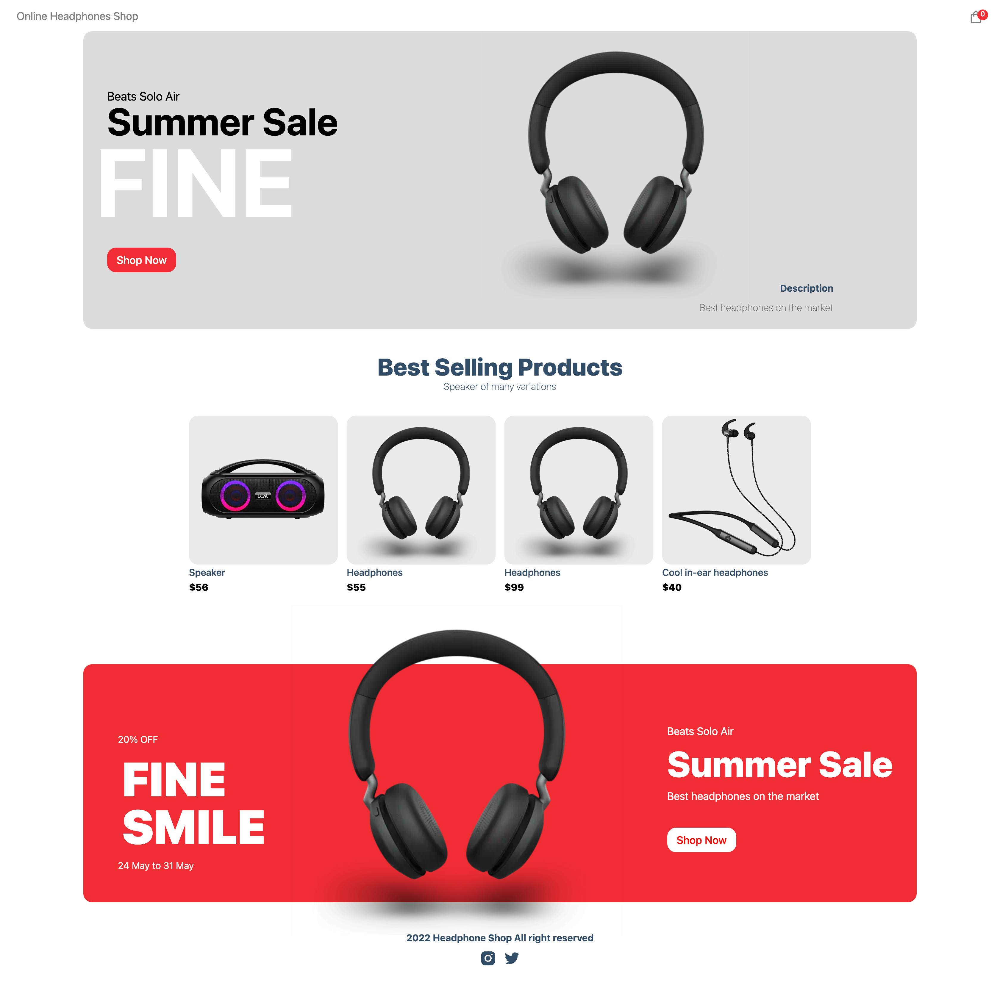
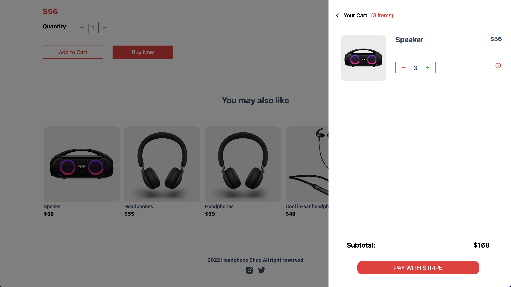
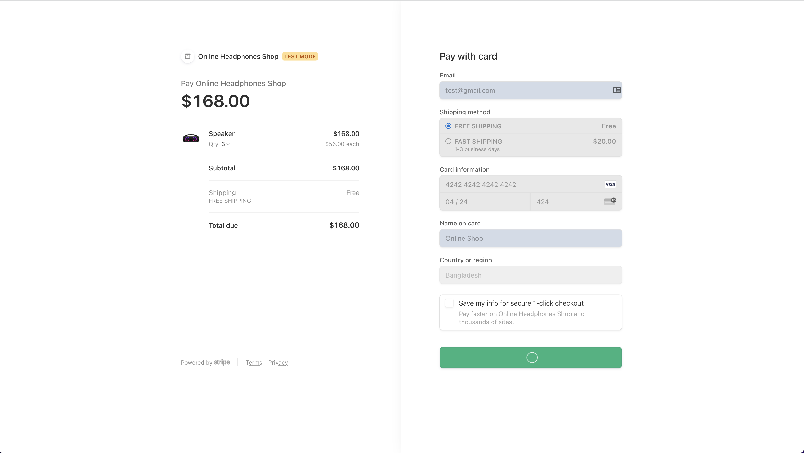
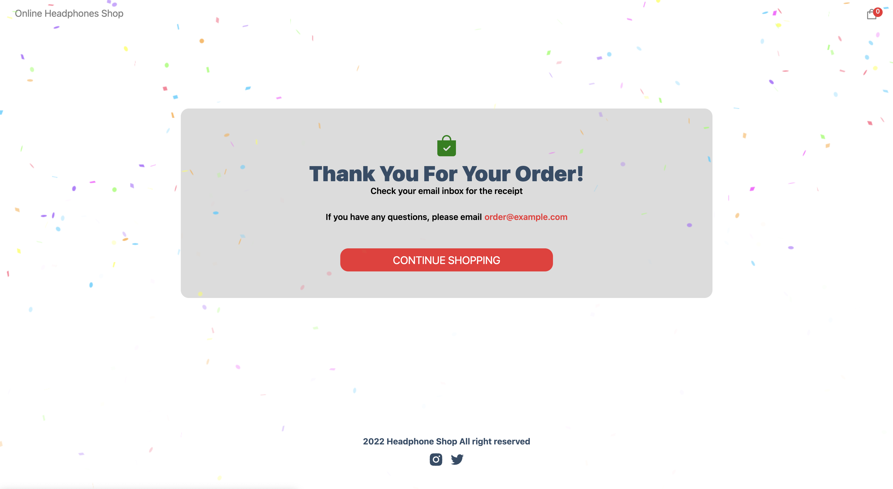

# E-commerce || Build with NextJs, Sanity and Payment gateway - Stripe.

<div align="center">
  
  &nbsp;&nbsp;

</div>

# Deploy in **VERCEL**  <a href="https://ecommerce-full-stack-next-app.vercel.app/" target="_blank" target="_blank" title="E-commerce shop" >Click Here!</a> 

# Quick Overview - Setup & Run

#### Step - 1

Download or Clone

```sh
git clone https://github.com/livealvi/Ecommerce--Full-Stack--NEXT-App.git
```

#### Step - 2

```bash
cd Ecommerce--Full-Stack--NEXT-App
```

#### Step - 4

```bash
npm i
#or
npm install
#or
yarn add
```

#### Step - 5

create `.env` file from `.env.example` need [Stripe](https://stripe.com/) & [Sanity](https://www.sanity.io/)

- Token - Sanity
- Publishable key - Stripe
- Secret key - Stripe

#### Step - 6

Build & Run the project

First, run the development server:

```bash
npm run dev
#or
yarn dev
```

Open [http://localhost:3000](http://localhost:3000) with your browser to see the result.

# Screenshot

## #Homepage



## #Product Page



## #Cart


## #Payment Page - Stripe



## #Purchased


